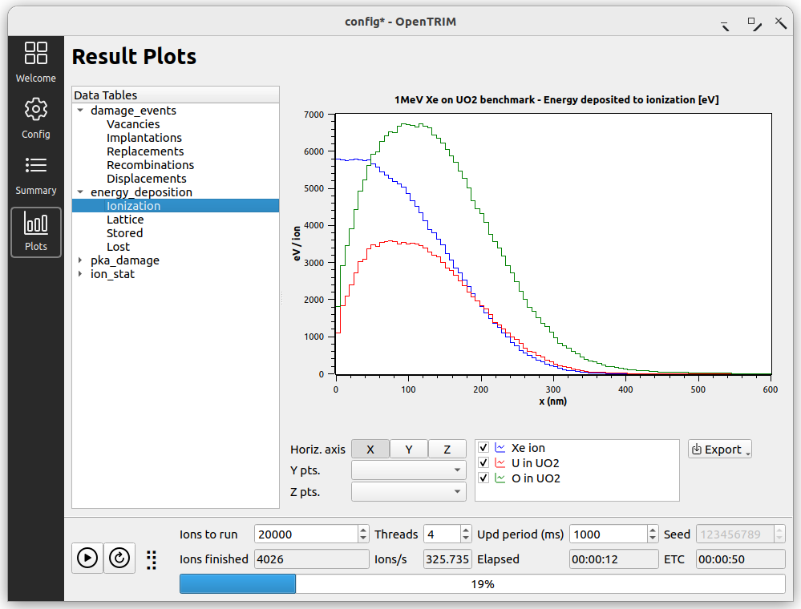

# `OpenTRIM`

A C++ Monte-Carlo code for simulating ion transport in materials with an emphasis on calculation of radiation damage.

`OpenTRIM` offers the following components:

- `opentrim-gui`: A GUI tool to configure, run and evaluate simulations 
- `opentrim`: A command line program for batch mode 
- `libopentrim`: A C++ library with all the ion transport code, which can be linked to external applications
- `libxs_*`: A set of C++ libraries for screened Coulomb scattering calculations with various potentials, `* = ZBL, Moliere, ...` 
- `libdedx`: A C++ library for electronic stopping & straggling calculations 

Documentation can be found here: https://ir2-lab.gitlab.io/opentrim



## Installation

### Binary packages

Binary packages and repositories for a number of **Linux** distributions (Ubuntu, RHEL, OpenSUSE, etc.) are built on the [openSUSE Build Service](https://software.opensuse.org//download.html?project=home%3Amaxiotis%3Agapost&package=opentrim). Please follow the instructions found there to install OpenTRIM on your system.

On **Windows**, please download the latest binary distribution release provided as a zip file and extract to some location. To be able to run the program from the windows command line, add the program folder to the user or system path.

### Building from source

On **Linux** the project can be built and installed with `cmake`.

Tested compilers: GCC 8 and above, Clang 14. 

Clone the project using
```
> git clone git@gitlab.com:ir2-lab/opentrim.git
```
or download a tarball of the last version.

To build OpenTRIM you will need the following libraries:
- [Eigen v3.4.0](https://eigen.tuxfamily.org) for vector operations
- [HDF5 v1.10.7](https://www.hdfgroup.org/solutions/hdf5/) for file storage
- [Qt5 or Qt6](https://www.qt.io/) for the GUI program
- [Qwt v6.x](https://qwt.sourceforge.io/) for plotting

They can be installed with
```bash
# Ubuntu 22.04 / DEB
sudo apt install libeigen3-dev libhdf5-dev libhdf5-103-1 
# for the GUI component add the following
sudo apt install qtbase5-dev libqt5svg5 libqwt-qt5-dev libqwt-qt5-6

# RHEL 9 / RPM
sudo dnf install eigen3-devel.noarch hdf5.x86_64 hdf5-devel.x86_64
```  

Basic build recipe (run from project directory):

```
mkdir build
cd build
cmake .. -DCMAKE_BUILD_TYPE=Release
ninja
ninja install
```
The default install location is `$HOME/.local`, thus `sudo` is not required.
Override this by setting the option `-DCMAKE_INSTALL_PREFIX="/your/install/location"` when calling `cmake`. 

On **Windows** the project can be built with [MSYS2](https://www.msys2.org/). Detailed instructions will be given in the future.

## Usage

The GUI application can be invoked from the command line 
```
> opentrim-gui
```
or by double-clicking the executable. Some simulation examples are included in the program and can be readily used as templates. 

The command line program can be invoked by 

```
> opentrim [options] [-f config.json]
```
The program accepts a JSON-formatted configuration input either
directly from a file (with the `-f` option) or from stdin.

To see all available options run `opentrim -h`, which prints
```
Monte-Carlo ion transport simulation
Usage:
  opentrim [OPTION...]

  -n arg            Number of histories to run (overrides config input)
  -j arg            Number of threads (overrides config input)
  -s, --seed arg    random generator seed (overrides config input)
  -i, --input arg   input HDF5 file name
  -f arg            JSON config file
  -o, --output arg  output HDF5 file name (overrides config input)
  -t, --template    print a template JSON config to stdout
  -v, --version     Display version information
  -h, --help        Display short help message
```

The cli program first checks and validates the configuration input. 
It then runs the simulation and saves the results into a HDF5 archive.

## Testing

The examples contained in the GUI app can be used for testing.

Some benchmarks for comparison to other codes are given in folder `test/`.
The file [`test/README.md`](test/README.md) gives a short description of each benchmark.

The folders [`test/opentrim/b1`](test/opentrim/b1) to [`b7`](test/opentrim/b7) have config files for running the benchmarks with `opentrim -f config.json`.

The file [`test/octave/plot_benchmark.m`](test/octave/plot_benchmark.m) is a MATLAB/OCTAVE script which can be used for plotting benchmark results.

## Credits

`OpenTRIM` draws heavily on [SRIM](http://www.srim.org/) by [J.F. Ziegler](ziegler[at]srim.org), one of the first ion simulation programs created in the 80s and still widely used until today. The electronic energy loss data in `OpenTRIM` have been obtained from the [SRIM-2013](http://www.srim.org/) distribution using the provided utility `SRmodule.exe`.

Many ideas, techniques and code were taken from the following open-source ion simulation programs:

- The program [iradina](https://sourceforge.net/projects/iradina/) written by Ch. Borschel & C. Ronning and extended by J.P. Crocombette & Ch. Van Wambeke.
- The program [Corteo](http://www.lps.umontreal.ca/%7Eschiette/index.php?n=Recherche.Corteo) by F. Schiettekatte.

The [Eigen](http://eigen.tuxfamily.org/) library by B. Jacob & G. Guennebaud is used for 3D vector math.

The [Xoshiro256+](https://prng.di.unimi.it/) algorithm by D. Blackman and S. Vigna is used for random number generation.

[JSON for Modern C++](https://github.com/nlohmann/json) by N. Lohmann is used for encoding/decoding program options to/from json.

[cxxopts](https://github.com/jarro2783/cxxopts) by [jarro2783](https://github.com/jarro2783) is used for handling cli options.

The [HDF5 library](https://github.com/HDFGroup/hdf5) with the [HighFive C++ interface](https://github.com/BlueBrain/HighFive) are used for saving results to the HDF5 archive.