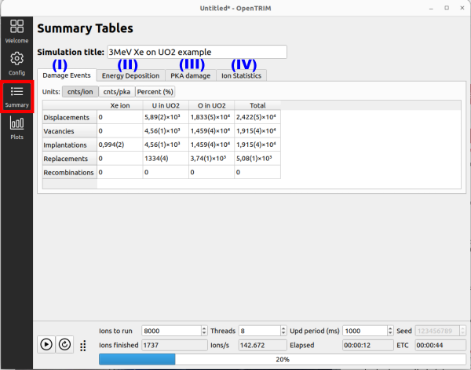

This is a guide for running your first simulations with **openTrim**. The easiest way is by modifying existing examples, and this is what is described in the following steps.

1. On start Screen click on "Examples" button. 

    

2. Double-click on one example. ( In order to demonstrate some capabilities, third example is going to be run )

    
   

3. Click **OK** on the pop-up box asking you to discard current simulation.

      

4. User will be relocated at **CONFIGURATION PANEL**
   -  On top line the title can be seen and modified manualy.
  
   -  At the bottom left side of the ***Configuration***  panel one can either **run** simulation by pressing **play button** (1) or navigate through options and modify them.
  
   -  At the bottom one can choose number of ions to be run (2), number of threads to be used for the simulation (3), ect and data progress of simulation data are depicted in real time on relevant boxes.
  
    
  

  
 - ***This panel consists of four tabs***:
  
   ### I. General Simulation options
   This tab contains options regarding simulation types, physical models and processes. Further details regarding these can be found in [Documentation](https://ir2-lab.gitlab.io/opentrim/) .

   ### II. Ion transport options
   This tab contains options regarding energy cutoff under which ions are not recorded anymore and flight path type along with related options.

   ### III. Ion Source
   Here the user can load/modify data regarding physical properties and geomatrical distribution of ion source of the simulation.

   ### IV. Target
   This tab contains options regarding target materials, geometry and binning.
   
   ### V. Output
   At this tab data regarding output data handling can be found.

   ### VI. JSON
   Data of all tabs are stored in a .json file format which can be seen at this final tab.

   **After tabs are reviewed and/or modified accordingly press play button and simulation will run** 

5. **SUMMARY PANEL**
   
   

   During simulation run, user can find information on physical properties of interest in real time and in a variety of units. These information are recorded in four tabs: 

   - Damage Events (I)
   - Energy Deposition (II)
   - PKA damage (III)
   - Ion Statistics (IV)

6. **PLOTS PANEL**
   
   

   Data reported in former "Summary Panel" are plotted in real time at the **Plots Tab** for ions and each target material required by the user. All plots can also be saved in .pdf or .csv format by pressing **Export** button. 
