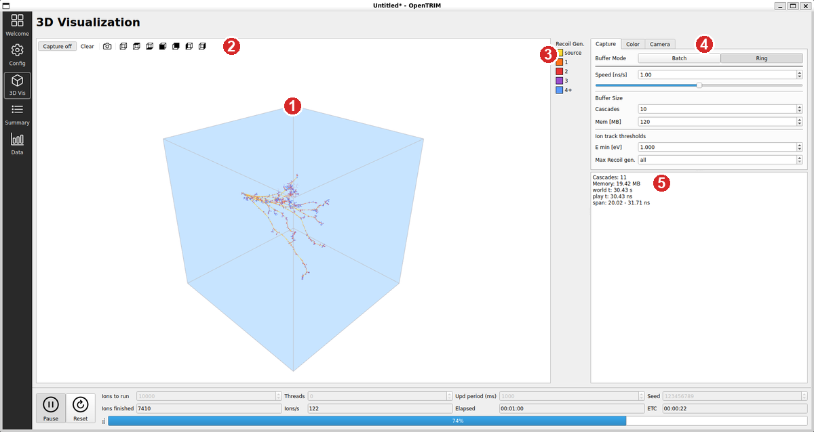
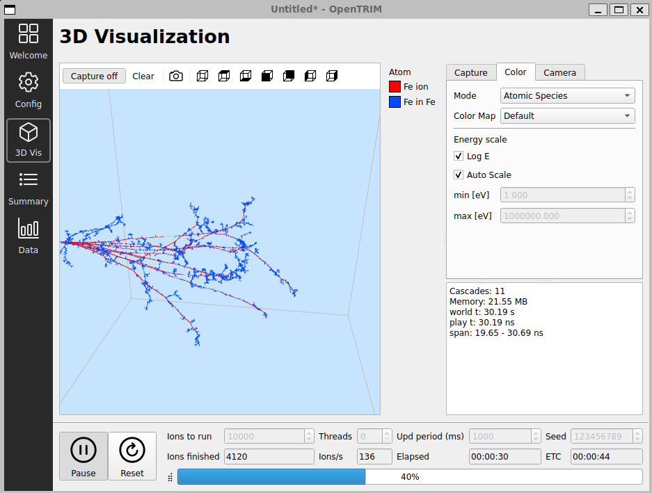

This is a short guide to the **3D Visualization** panel, which draws the ion and
recoil tracks of a running simulation in real time.

Open the viewer with the **"3D Vis"** button on the left. Click the **"?"** button
on the viewer toolbar to open this guide. The panel has five parts:

  1. the **3D scene** with the target box and the captured tracks,
  2. the **toolbar** for capture, screenshots and preset views,
  3. the **color legend**, which matches the current color mode,
  4. the **control tabs** ("Capture", "Color", "Camera"),
  5. the **status panel**, reporting how much data is currently held.

### 1. Capturing tracks

Capture starts automatically when a simulation is created and follows the run:
it pauses when the simulation is paused or stopped, or when the 3D view is
hidden and resumes when the view and simulation run again. Track events are
copied from the simulation worker into a bounded buffer;
a separate thread processes them and the scene is redrawn, so the interface stays
responsive.

On the toolbar:

  - **"Capture on/off"** manually disables or re-enables capture. Its label
    tracks the state ("Capture on", "Capture off", "Paused") and it blinks while
    a capture is finishing or pausing.
  - **"Clear"** drops everything currently held.

The **"Capture"** tab sets how much is kept:

  - **Buffer Mode**
    - **Ring** (default) captures continuously in a buffer of the size set below.
      When the buffer is full, the oldest cascade is dropped.
    - **Batch** captures until the buffer is full, then stops.
  - **Speed [ns/s]** is the playback rate: simulation time advances at this many
    nanoseconds per real second. The slider is logarithmic.
  - **Buffer Size**
    - **Cascades** is the number of cascades to keep.
    - **Mem [MB]** is an upper bound on the memory used.
  - **Ion track thresholds**
    - **E min [eV]** drops tracks once the ion energy falls below this value.
    - **Max Recoil gen.** drops recoils above this generation. "all" keeps every
      generation.

Changing a buffer size or a threshold clears the current buffer.

### 2. Navigating the scene

  - **Left drag** orbits the camera.
  - **Right drag** or **middle drag** pans.
  - **Wheel** zooms.

The toolbar has preset view buttons: a home/isometric view, and the six axis
views (top, bottom, front, back, left, right).

### 3. Coloring tracks

The **"Color"** tab sets how tracks are colored. The legend (3) always matches
the current mode.

  - **Mode**
    - **Recoil Generation** colors each track by its generation (source ion,
      1, 2, 3, 4+).
    - **Energy** colors each point by the ion energy at that point.
    - **Atomic Species** colors each track by its atom.
  - **Color Map** is filled to match the mode. Energy offers continuous maps
    (Ramp, Rainbow, Turbo); the generation and species modes offer discrete
    palettes (Default, Tab10).
  - **Energy scale** applies to the Energy mode.
    - **Log E** switches between a linear and a logarithmic scale.
    - **Auto Scale** fits the scale to the data. Turn it off to set **min [eV]**
      and **max [eV]** by hand.

### 4. Playback

Playback replays the captured tracks over simulation time, so a cascade grows
from its start point as time advances. The rate is the **Speed [ns/s]** value on
the "Capture" tab. The status panel (5) reports the current play time and the
time span held in the buffer.

### 5. Saving

  - The **camera icon** on the toolbar saves a high resolution screenshot to a
    PNG file.
  - The **"Camera"** tab saves the current view to a JSON file and restores it
    later, so a fixed viewpoint can be reused across runs.
