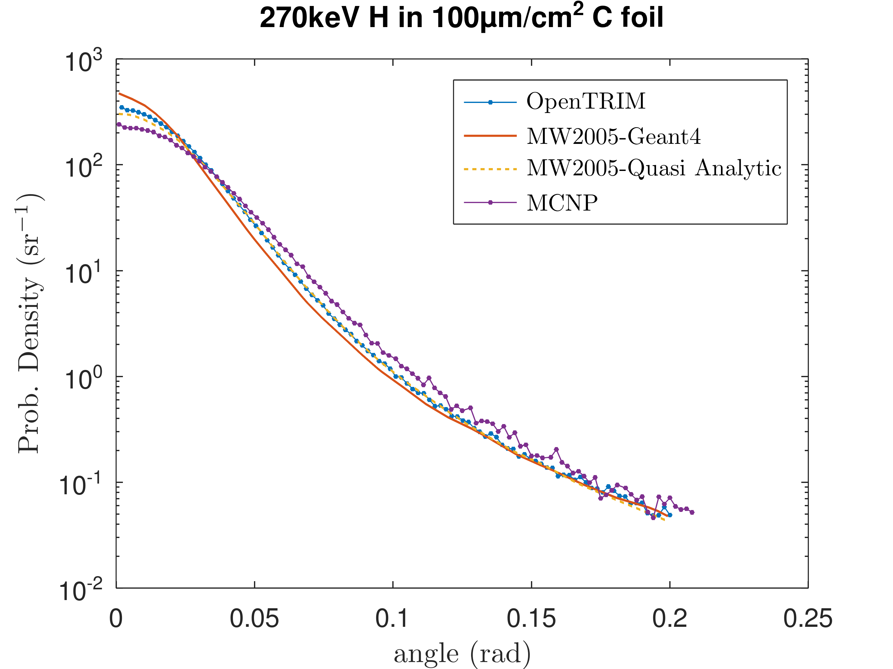
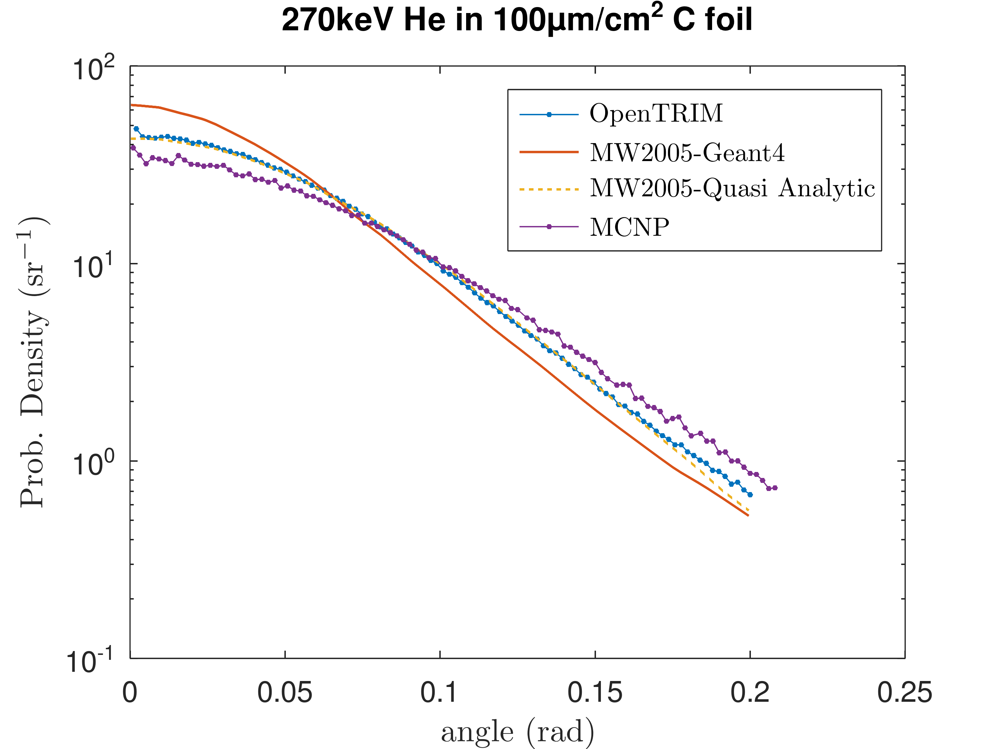

# Benchmarks

## Damage profiles

Compare to Crocombette2019, Lin2023 (Fe → Fe, Xe → UO2) \
H → Fe is for checking behaviour with light ions \
Fe cascades in Fe to compare to Nordlund2015

1. 2 MeV Fe in Fe target, t = 1200 nm
2. 500 keV Fe in Fe target, t = 600 nm
3. 3 MeV Xe in UO2 target, t = 1200 nm
4. 1 MeV Xe in UO2 target, t = 600 nm
5. 300 keV Xe in UO2 target, t = 300 nm
6. 3 MeV H in Fe target, t = 50 μm
7. 1 MeV H in Fe target, t = 10 μm
8. 50 keV Fe cascade in Fe

The above should be run for comparison in 
- SRIM FC mode + setting "Lowest E" in `TDATA.sav` equal to $E_d$ - **done!** 
- SRIM QC - *todo*
- #6 and #7 also in SRIM ML mode (see below) - **done!**
- Iradina - **done!**

N ions = 20000

### SRIM monolayer mode

*This is another not well documented SRIM feature !!!!*

If you select FC mode with a light ion, e.g. 1 MeV H in Fe, SRIM gives you this warning:

> Energetic Light Ions with Full Cascades?
> 
> You have specified    a calculation for an energetic light ion into a target with full damage cascades. Although the average TRIM calculation results will be correct, there may be anomalous peaks and dips in the damage distributions. TRIM uses the concept of a Free Flight Path for the ion. That is, the ion does not have a full interaction at every monolayer of the target but instead it skips over many atoms between each detailed collision. The damage is then statistically distributed back over this path. The Free Flight Path can be quite large, almost 1um for a 10 MeV proton in a light target (carbon). This means that the kinetics of the ion/target interactions is calculated for one point, and then a jump of 1 um is made before the next detailed calculation. The damage which occurs during the jump is calculated and distributed over the 1 um Flight Path.    So the energy loss by the ion to the target is evenly distributed and no anomalies should occur.
> 
> However, damage cascades are only inintiated at the end of each flight path, and if a cascade of target atoms is initiated, it can only start in one place (it can't be distributed statistically). Hence there may appear anomalous peaks in the total recoil atom damage about one Free Flight Path from the surface or an interface. Similarly, there may be anomalous dips in the calculated damage near the surface since all ions start with a large initial Free Flight Path and may not indicate any recoil cascades near the surface.
It is suggested that you try TRIM to see if any of these anomalous peaks and dips occur for your calculation of target recoil damage. If you see a problem, then it can be easily corrected by eliminated the Free Flight Path from the calculation. This is done in the TRIM Setup Window, in the upper right menu called DAMAGE. Select the third item in the drop-down menu: "Surface Sputtering / Monolayer Collision Steps". This will eliminate all Free Flight Paths, and all the collision cascades will be correctly calculated. 
> 
> Note that this "fix" will slow TRIM down by a large factor, 10-50x. But it is necessary for accurate results.

However, there are the following problems:

1. **VACANCY.txt**: In monolayer mode the file has 2 columns ("V by ions", "V by recoils") just as in QC. Note that FC has different columns: e.g. for H in Fe ("H knock-ons", "Fe vacancies")
2. However, it seems that the column designation in ML mode is in error! Specifically, the SRIM-ML results for benchmarks #6 & #7 are comparable to SRIM-FC and OpenTRIM only if it is assumed that the 2nd column in VACANCY.txt, "V by recoils", is actually "Fe Vacancies" as in FC mode.
3. In the VACANCY.txt of monolayer mode there is another warning (!!!):
> NOTE: Vacancies not accurately calculated in SPUTTERING calculation.   
> Atoms move if Energy > E(surface) instead of Energy > E(displacement)  
> Quick Fix for near-surface vacancies: Make E(surface)= E(displacement),
> and use Monolayer Steps (TRIM Damage Setup). Not perfect, but OK.  

Thus we must additionally put Es = Ed ??

We should test it in the future

## Multiple scattering

Compare to the data of Mendenhall-Weller 2005 for 270 keV He and H ions passing through a 100μg/cm2 C foil.

We run the same test cases with MW2005 with the following OpenTRIM settings:
```javascript
"Transport": {
        "flight_path_type": "Variable",
        "min_scattering_angle": 0.1
    }
```

The minimum scattering angle $\theta=0.1^\circ \approx 0.002$ rad ensures that we will have correct results down to the smallest histogram bin.

This is a  small angle multiple scattering calculation. In MW2005 they use a 1eV lower bound for the recoil energy and calculate the mfp accordingly. (for more details on flight path selection algorithms see the documentation). They report that the resulting mfp was very long and this was a problem for the calculation because there were very few scattering events.
They improved the results by biasing the algorithm to impose scattering in the foil.


In our case we set a minimum scattering angle $\theta_{min}$. This ensures that scattering events with angles as low as $\theta_{min}$ will be included. 
We run the same test cases as MW2005 with the following OpenTRIM settings:
```javascript
"Transport": {
        "flight_path_type": "Variable",
        "min_scattering_angle": 0.1
    }
``` 
The minimum scattering angle $\theta_{min}=0.1^\circ \approx 0.002$ rad ensures that we will have correct results down to the smallest required histogram bin.

The results are shown in the 2 following graphs in comparison to the corresponding MW2005 data. An MCNP obtained curve is also shown.

It is seen that OpenTRIM almost coincides with MW2005's "Quasi Analytic" curves, which they consider most accurate. Their Monte-Carlo results obtained by Geant4 with their special coding of screened Coulomb interaction are not so accurate.
This is due to 
1. their use of only a recoil energy cutoff and not an angle cutoff 
2. their biasing/variance reduction scheme 






The config files to run the cases are in folders 
- `test/msc/opentrim` has config files to run the 2 cases 
- `test/msc/MW2005` has the MW2005 data, digitized from figs 5 & 6
- `test/msc/mcnp` has the MCNP results


