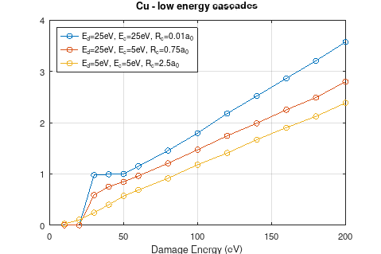
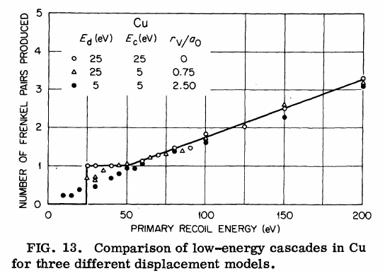
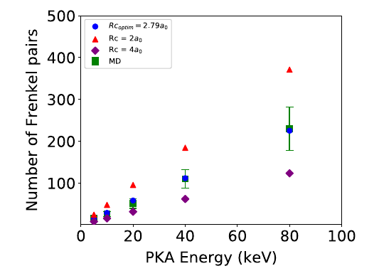
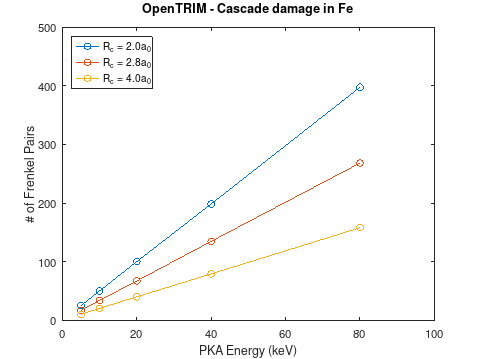
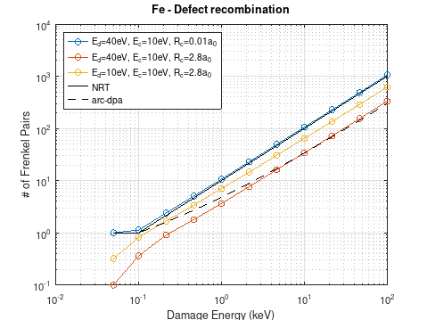

# OpenTRIM Defect recombination

OpenTRIM simulates defect recombination as follows:
- All recoils of a PKA cascade are simulated until their energy reaches the lower cutoff $E_c$ (json `/Transport/min_energy`, typically 1-10 eV), whereas they stop and are considered implanted/interstitial atoms.
- The vacancy and interstitial defects generated during the cascade are sorted in a list according to their creation time
- For each defect in the list, a search is done among pre-existing defects to find anti-defects within the recombination radius $R_c$ (json `Target/materials/0/composition/0/Rc`, typically some nm)
- The defect recombines with the closest antidefect of the same atomic type. They are both deleted from the defect list.
  
Key parameters that define the behaviour are $E_d$, $E_c$ and $R_c$.

We compare OpenTRIM recombination results with a number of published simulations with MARLOWE and MD.

## 1. Low energy cascades in Cu

Comparison to MARLOWE simulations from Robinson1974 "Computer simulation ...." using the same parameter values.

OpenTRIM cascades are simulated with electronic stopping switched off (json `Simulation.electronic_stopping = 'Off'`), so that PKA energy = damage energy.

OpenTRIM gives generally lower defect numbers for the same set of $(E_d,E_c,R_c)$ parameters.

Script for running the OpenTRIM simulations:
- [Cu_LowE.m](./Cu_lowE/Cu_LowE.m) (Octave)

## 2. Cascades in Fe

### 2.1 Comparison to MD results published in Nordlund2015

> K. Nordlund et al., “Primary radiation damage in materials: Review of current understanding and proposed new standard displacement damage model to incorporate in cascade defect production efficiency and mixing effects,” OECD Nuclear Energy Agency, Paris, Jan. 2015.

In page 61, data are given for damage (FP number $N_{FP}$) in Fe 78.7 keV PKA cascade which corresponds to 50 keV damage energy. The data are taken from MD simulations by Stoller, SRIM simulations and arc-dpa model. $E_d$ is 40 eV

| Simulation Method          | $N_{FP}$ |
| -------------------------- | -------- |
| 50keV, MD, 100K            | 168 ± 4  |
| 50keV, NRT model           | 500      |
| 78.7keV, SRIM FC           | 1099     |
| 78.7keV, SRIM QC           | 530      |
| 78.7keV, arc-dpa + SRIM QC | 218      |

Cascade simulations were performed with OpenTRIM setting  `Simulation.simulation_type = CascadesOnly` and two initial conditions 
- $E=78.7$ keV + stopping 
- $E=50$ keV + stopping switched off. 

Defect numbers are obtained with and without recombination. $R_c=2.8a_0=0.8$ nm (value from Ortiz2020 - see below).

Results:
| Simulation Method          | $N_{FP}$ | Comment                         |
| -------------------------- | -------- | ------------------------------- |
| 50keV, no stopping, Recomb | 166      | Excellent agreement to MD (168) |
| 78.7keV, Recomb            | 197      | Good agreement to arc-dpa (218) |
| 50keV, no stopping         | 528      | Good agreement to NRT (500)     |
| 78.7keV                    | 646      | Lower than SRIM FC (1099)*      |
| 78.7keV, NRT-LSS           | 507      | Good agreement to SRIM QC (530) |

Scripts for running the OpenTRIM simulations:
- [Fe_Case1.ipynb](./Fe_Cascades/Fe_Case1.ipynb) (Python) 
- [Fe_Case1.m](./Fe_Cascades/Fe_Case1.m) (Octave)

### 2.2 Comparison to MD & MARLOWE results from Ortiz2020

> C. J. Ortiz, L. Luneville, and D. Simeone, “Binary Collision Approximation,” > in Comprehensive Nuclear Materials, Elsevier, 2020, pp. 595–619

- Fig. 9 "Number of Frenkel pairs in Fe calculated with the MD (green squares) and with the BCA for different capture radii. The results obtained
with the BCA for the optimum capture radius (blue circles) is shown."

OpenTRIM `CascadeOnly` simulations are performed with the following settings:
- electronic stopping switched off `Simulation.electronic_stopping = "Off"`
- Ed = 40 eV
- Ec = 10 eV
- Rc = 2, 2.8 and 4$a_0$

The results are in good agreement with Ortiz2020.
  

Scripts for running the OpenTRIM simulations:
- [Fe_Case2.ipynb](./Fe_Cascades/Fe_Case2.ipynb) (Python) 
- [Fe_Case2.m](./Fe_Cascades/Fe_Case2.m) (Octave)

### 2.3 Comparison to arc-dpa damage model

OpenTRIM cascade simulations in Fe from low (0.1 keV) to high (100 keV) damage energy. Defect recombination is considered with the following parameter sets:
- $E_d=40$ eV, $R_c=0$ (No recombination)
- $E_d=40$ eV, $R_c=2.8a_0$ 
- $E_d=10$ eV, $R_c=2.8a_0$ 
In all cases the lower cutoff energy is $E_c=1$ eV.

