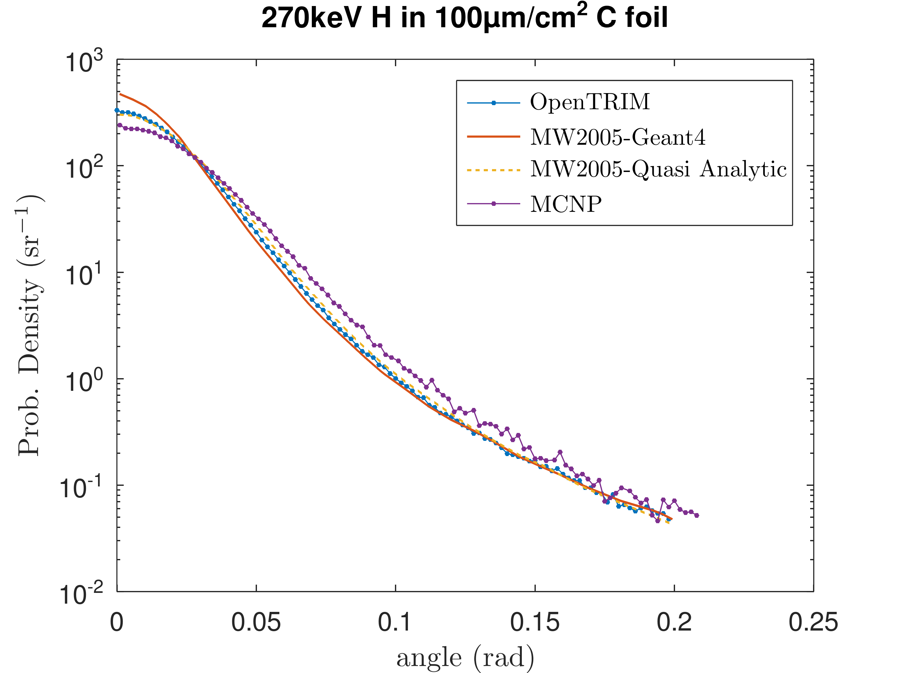
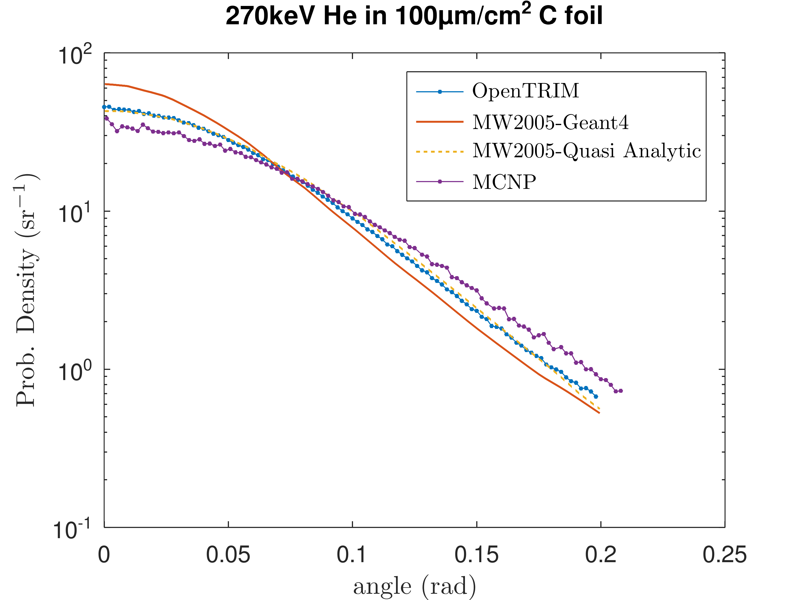

## Validation of OpenTRIM multiple scattering calculation

Compare to the data of Mendenhall-Weller 2005 for scattering of 270 keV He and H ions passing through a 100μg/cm2 C foil.

In their 2005 paper, Mendenhall-Weller test the screened Coulomb scattering routines they created for GEANT4 by calculating the small angle deflection of a
270 keV light ions after passing through a thin C foil. 

This is a small angle multiple scattering problem. For He, MW2005 set a 1eV lower bound for the recoil energy so that the mean free path is smaller that the foil. However, it was not enough for calculating H. In this case, they improved the results by biasing the algorithm to impose scattering in the foil.

They give also a "Quasi-Analytic" calculation of multiple scattering in the small-angle approximation. Their GEANT4 results approach this quasi-analytic curve as they improve the simulation by setting a lower recoil energy bound or by biasing.

OpenTRIM is more flexibility for such simulations, since one can either set a lower cutoff to the scattering angle, $\theta_{min}$, so that low angle events are not ignored, or, set explicitly an upper bound to the mean free path. Here, we choose the latter option for more efficiency and set the mean free path to 1/100th of the layer thickness. 
```javascript
"Transport": {
        "flight_path_type": "Variable",
        "mfp_range": [
            1,
            30
        ]
    }
```
Note that the `mfp_range` values are in units of the atomic radius of the material, $R_{at}$. For C, $R_{at}=0.128$ nm and the foil thickness is 440 nm. Thus the upper limit to the mfp is $440 \div 100 \div 0.128 \sim 34 R_{at}$ to ensure the ion has at least 100 collisions inside the foil. 

The results are shown in the 2 following graphs in comparison to the corresponding MW2005 data. An MCNP obtained curve is also shown.

It is seen that OpenTRIM almost coincides with MW2005's "Quasi Analytic" curves, which is accurate at small angles. The Monte-Carlo results obtained by GEANT4 with their special coding of screened Coulomb interaction are not so accurate.
This is due to 
1. their use of only a recoil energy cutoff and not an angle cutoff 
2. their biasing/variance reduction scheme 






### Files

- `opentrim/` has json config files to run the 2 cases. UserTally is used for getting the scattering angle curve. 
- `msc.m` runs the OpenTRIM cases in octave and produces the plots. The $x$-axis cosine bins, $n_x$, are computed in octave.  
- `MW2005/` has the MW2005 data, digitized from figs 5 & 6
- `mcnp/` has the MCNP results

